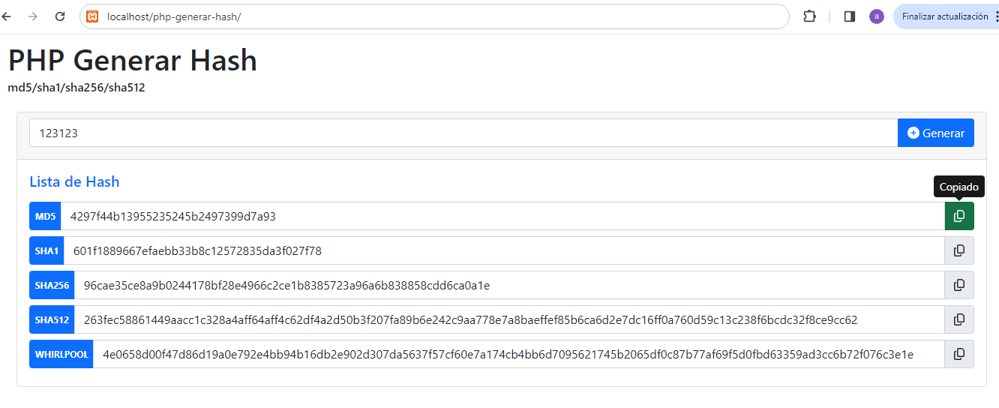
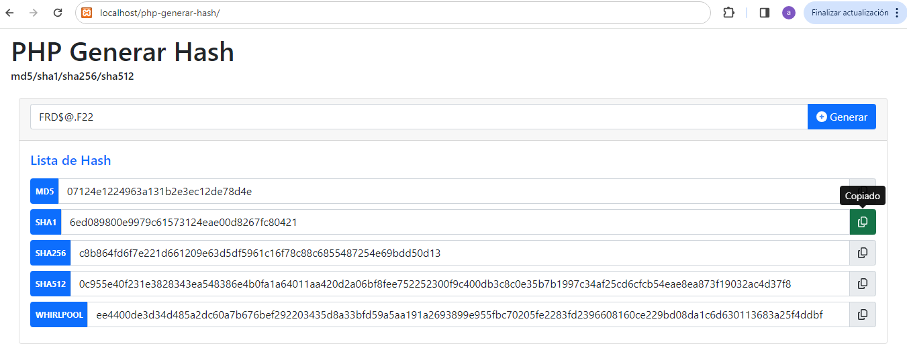

# php-generar-hash
PHP 7, PHP 8 donde ingresas un texto y genera los Hash md5/sha1/sha256/sha512 [https://www.php.net/manual/es/function.hash.php]


## Librerias
- [ ] jquery-3.7.1. [https://jquery.com/download/]
- [ ] Bootstrap 5.1 [https://getbootstrap.com/docs/5.1/getting-started/download/]
- [ ] sweetalert2 [https://sweetalert2.github.io/#download]
- [ ] Font Awesome Free 6.5.1 [https://fontawesome.com/download]


## Clonar Repositorio
```
git clone https://github.com/compuvalpo/php-generar-hash.git
```


## Lavantar Repositorio en local
Una vez clonado el repositorio en su carpeta de Apache [www - htdocs - html - u otra según su versión] debe acceder a la siguiente url
`http://localhost/php-generar-hash`


## Capturas

